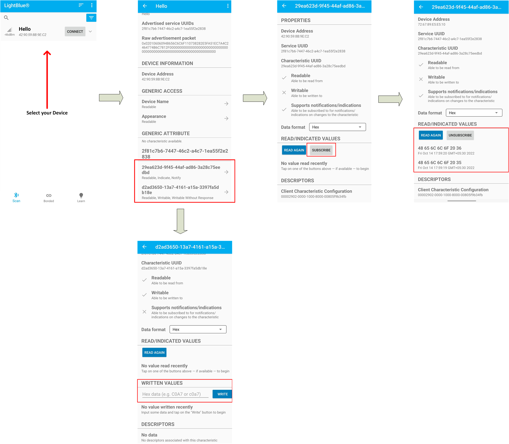

# BTSTACK: Bluetooth&reg; LE Hello Sensor

This code example demonstrates the implementation of Bluetooth&reg; LE custom service with Bluetooth&reg; security using AIROC&trade; CYW20829, PSoC&trade; 6 , and ModusToolbox&trade; software environment.

[View this README on GitHub.](https://github.com/Infineon/mtb-example-btstack-freertos-hello-sensor)

[Provide feedback on this code example.](https://cypress.co1.qualtrics.com/jfe/form/SV_1NTns53sK2yiljn?Q_EED=eyJVbmlxdWUgRG9jIElkIjoiQ0UyMzUxNTAiLCJTcGVjIE51bWJlciI6IjAwMi0zNTE1MCIsIkRvYyBUaXRsZSI6IkJUU1RBQ0s6IEJsdWV0b290aCZyZWc7IExFIEhlbGxvIFNlbnNvciIsInJpZCI6Im5oZWciLCJEb2MgdmVyc2lvbiI6IjMuMS4wIiwiRG9jIExhbmd1YWdlIjoiRW5nbGlzaCIsIkRvYyBEaXZpc2lvbiI6Ik1DRCIsIkRvYyBCVSI6IklDVyIsIkRvYyBGYW1pbHkiOiJCVEFCTEUifQ==)

## Requirements

- [ModusToolbox&trade; software](https://www.infineon.com/modustoolbox) v3.0 or later (tested with v3.0)
- Board support package (BSP) minimum required version for :
   - CY8CKIT-062-BLE : v4.0.0
   - CY8CPROTO-063-BLE : v4.0.0
   - CYBLE-416045-EVAL : v4.0.0
   - CYW920829M2EVB-01 : release v1.0.0 beta
- Programming language: C
- Associated parts: [AIROC&trade; CYW20829 Bluetooth&reg; LE SoC](https://www.infineon.com/cms/en/product/promopages/airoc20829), [PSoC&trade; 6 MCU with AIROC&trade; Bluetooth&reg; LE](https://www.infineon.com/cms/en/product/microcontroller/32-bit-psoc-arm-cortex-microcontroller/psoc-6-32-bit-arm-cortex-m4-mcu/psoc-63/)

## Supported toolchains (make variable 'TOOLCHAIN')

- GNU Arm&reg; embedded compiler v10.3.1 (`GCC_ARM`) - Default value of `TOOLCHAIN`
- Arm&reg; compiler v6.16 (`ARM`)
- Arm&reg; compiler v6.13 (`ARM`)
- IAR C/C++ compiler v9.30.1 (`IAR`)
- IAR C/C++ compiler v8.42.2 (`IAR`)

## Supported kits (make variable 'TARGET')

- [AIROC&trade; CYW20829 Bluetooth&reg; LE SoC](https://www.infineon.com/cms/en/product/promopages/airoc20829) (`CYW920829M2EVB-01`)  – Default value of `TARGET`
- [PSoC&trade; 6 Wi-Fi Bluetooth&reg; prototyping kit](https://www.infineon.com/CY8CPROTO-062-4343W) (`CY8CPROTO-062-4343W`)
- [PSoC&trade; 6 Wi-Fi Bluetooth&reg; pioneer kit](https://www.infineon.com/CY8CKIT-062-WIFI-BT) (`CY8CKIT-062-WIFI-BT`)
- [PSoC&trade; 62S2 Wi-Fi Bluetooth&reg; pioneer kit](https://www.infineon.com/CY8CKIT-062S2-43012) (`CY8CKIT-062S2-43012`)
- [PSoC&trade; 62S1 Wi-Fi Bluetooth&reg; pioneer kit](https://www.infineon.com/CYW9P62S1-43438EVB-01) (`CYW9P62S1-43438EVB-01`)
- [PSoC&trade; 62S1 Wi-Fi Bluetooth&reg; pioneer kit](https://www.infineon.com/CYW9P62S1-43012EVB-01) (`CYW9P62S1-43012EVB-01`)
- [PSoC&trade; 62S3 Wi-Fi Bluetooth&reg; prototyping kit](https://www.infineon.com/CY8CPROTO-062S3-4343W) (`CY8CPROTO-062S3-4343W`)
- [PSoC&trade; 62S2 evaluation kit](https://www.infineon.com/CY8CEVAL-062S2) (`CY8CEVAL-062S2`, `CY8CEVAL-062S2-LAI-4373M2`)
- [PSoC&trade; 6 Bluetooth&reg; LE pioneer kit](https://www.infineon.com/CY8CKIT-062-BLE) (`CY8CKIT-062-BLE`)
- [PSoC&trade; 6 Bluetooth&reg; LE prototyping kit](https://www.infineon.com/CY8CPROTO-063-BLE) (`CY8CPROTO-063-BLE`)
- [EZ-BLE Arduino Evaluation Board](https://www.infineon.com/cms/en/product/evaluation-boards/cyble-416045-eval/) (`CYBLE-416045-EVAL`)

## Hardware setup

This example uses the board's default configuration. See the kit user guide to ensure that the board is configured correctly.

**Note:** The PSoC&trade; 6 Bluetooth&reg; LE pioneer kit (CY8CKIT-062-BLE) and the PSoC&trade; 6 Wi-Fi Bluetooth&reg; pioneer kit (CY8CKIT-062-WIFI-BT) ship with KitProg2 installed. The ModusToolbox&trade; software requires KitProg3. Before using this code example, make sure that the board is upgraded to KitProg3. The tool and instructions are available in the [Firmware Loader](https://github.com/Infineon/Firmware-loader) GitHub repository. If you do not upgrade, you will see an error like "unable to find CMSIS-DAP device" or "KitProg firmware is out of date".

The AIROC&trade; CYW20829 Bluetooth&reg; kit (CYW920829M2EVB-01) ships with KitProg3 version 2.30 installed. The ModusToolbox&trade; software requires KitProg3 with latest version 2.40. Before using this code example, make sure that the board is upgraded to KitProg3. The tool and instructions are available in the Firmware Loader GitHub repository. If you do not upgrade, you will see an error such as "unable to find CMSIS-DAP device" or "KitProg firmware is out of date".

## Software setup

Download and install the LightBlue&reg; app for [iOS](https://apps.apple.com/us/app/lightblue/id557428110) or [Android](https://play.google.com/store/apps/details?id=com.punchthrough.lightblueexplorer&gl=US).

Scan the following QR codes from your mobile phone to download the LightBlue app.


Install a terminal emulator if you don't have one. Instructions in this document use [Tera Term](https://ttssh2.osdn.jp/index.html.en).

This example requires no additional software or tools.


## Using the code example

Create the project and open it using one of the following:

<details><summary><b>In Eclipse IDE for ModusToolbox&trade; software</b></summary>

1. Click the **New Application** link in the **Quick Panel** (or, use **File** > **New** > **ModusToolbox&trade; Application**). This launches the [Project Creator](https://www.infineon.com/ModusToolboxProjectCreator) tool.

2. Pick a kit supported by the code example from the list shown in the **Project Creator - Choose Board Support Package (BSP)** dialog.

   When you select a supported kit, the example is reconfigured automatically to work with the kit. To work with a different supported kit later, use the [Library Manager](https://www.infineon.com/ModusToolboxLibraryManager) to choose the BSP for the supported kit. You can use the Library Manager to select or update the BSP and firmware libraries used in this application. To access the Library Manager, click the link from the **Quick Panel**.

   You can also just start the application creation process again and select a different kit.

   If you want to use the application for a kit not listed here, you may need to update the source files. If the kit does not have the required resources, the application may not work.

3. In the **Project Creator - Select Application** dialog, choose the example by enabling the checkbox.

4. (Optional) Change the suggested **New Application Name**.

5. The **Application(s) Root Path** defaults to the Eclipse workspace which is usually the desired location for the application. If you want to store the application in a different location, you can change the *Application(s) Root Path* value. Applications that share libraries should be in the same root path.

6. Click **Create** to complete the application creation process.

For more details, see the [Eclipse IDE for ModusToolbox&trade; software user guide](https://www.infineon.com/MTBEclipseIDEUserGuide) (locally available at *{ModusToolbox&trade; software install directory}/docs_{version}/mt_ide_user_guide.pdf*).

</details>

<details><summary><b>In command-line interface (CLI)</b></summary>

ModusToolbox&trade; software provides the Project Creator as both a GUI tool and the command line tool, "project-creator-cli". The CLI tool can be used to create applications from a CLI terminal or from within batch files or shell scripts. This tool is available in the *{ModusToolbox&trade; software install directory}/tools_{version}/project-creator/* directory.

Use a CLI terminal to invoke the "project-creator-cli" tool. On Windows, use the command line "modus-shell" program provided in the ModusToolbox&trade; software installation instead of a standard Windows command-line application. This shell provides access to all ModusToolbox&trade; software tools. You can access it by typing `modus-shell` in the search box in the Windows menu. In Linux and macOS, you can use any terminal application.

The "project-creator-cli" tool has the following arguments:

Argument | Description | Required/optional
---------|-------------|-----------
`--board-id` | Defined in the `<id>` field of the [BSP](https://github.com/Infineon?q=bsp-manifest&type=&language=&sort=) manifest | Required
`--app-id`   | Defined in the `<id>` field of the [CE](https://github.com/Infineon?q=ce-manifest&type=&language=&sort=) manifest | Required
`--target-dir`| Specify the directory in which the application is to be created if you prefer not to use the default current working directory | Optional
`--user-app-name`| Specify the name of the application if you prefer to have a name other than the example's default name | Optional

<br />

The following example clones the "[Bluetooth&reg; LE Hello Sensor](https://github.com/Infineon/mtb-example-btstack-freertos-hello-sensor)" application with the desired name "HelloSensor" configured for the *CY8CKIT-062-WIFI-BT* BSP into the specified working directory, *C:/mtb_projects*:

   ```
   project-creator-cli --board-id CYW920829M2EVB-01 --app-id mtb-example-btstack-freertos-hello-sensor --user-app-name HelloSensor --target-dir "C:/mtb_projects"
   ```

**Note:** The project-creator-cli tool uses the `git clone` and `make getlibs` commands to fetch the repository and import the required libraries. For details, see the "Project creator tools" section of the [ModusToolbox&trade; software user guide](https://www.infineon.com/ModusToolboxUserGuide) (locally available at *{ModusToolbox&trade; software install directory}/docs_{version}/mtb_user_guide.pdf*).

To work with a different supported kit later, use the [Library Manager](https://www.infineon.com/ModusToolboxLibraryManager) to choose the BSP for the supported kit. You can invoke the Library Manager GUI tool from the terminal using `make library-manager` command or use the Library Manager CLI tool "library-manager-cli" to change the BSP.

The "library-manager-cli" tool has the following arguments:

Argument | Description | Required/optional
---------|-------------|-----------
`--add-bsp-name` | Name of the BSP that should be added to the application | Required
`--set-active-bsp` | Name of the BSP that should be as active BSP for the application | Required
`--add-bsp-version`| Specify the version of the BSP that should be added to the application if you do not wish to use the latest from manifest | Optional
`--add-bsp-location`| Specify the location of the BSP (local/shared) if you prefer to add the BSP in a shared path | Optional

<br />

Following example adds the CY8CPROTO-062-4343W BSP to the already created application and makes it the active BSP for the app:

   ```
   library-manager-cli --project "C:/mtb_projects/HelloSensor" --add-bsp-name CY8CPROTO-062-4343W --add-bsp-version "latest-v4.X" --add-bsp-location "local"

   library-manager-cli --project "C:/mtb_projects/HelloSensor" --set-active-bsp APP_CY8CPROTO-062-4343W
   ```

</details>

<details><summary><b>In third-party IDEs</b></summary>

Use one of the following options:

- **Use the standalone [Project Creator](https://www.infineon.com/ModusToolboxProjectCreator) tool:**

   1. Launch Project Creator from the Windows Start menu or from *{ModusToolbox&trade; software install directory}/tools_{version}/project-creator/project-creator.exe*.

   2. In the initial **Choose Board Support Package** screen, select the BSP, and click **Next**.

   3. In the **Select Application** screen, select the appropriate IDE from the **Target IDE** drop-down menu.

   4. Click **Create** and follow the instructions printed in the bottom pane to import or open the exported project in the respective IDE.

<br />

- **Use command-line interface (CLI):**

   1. Follow the instructions from the **In command-line interface (CLI)** section to create the application.

   2. Export the application to a supported IDE using the `make <ide>` command.

   3. Follow the instructions displayed in the terminal to create or import the application as an IDE project.

For a list of supported IDEs and more details, see the "Exporting to IDEs" section of the [ModusToolbox&trade; software user guide](https://www.infineon.com/ModusToolboxUserGuide) (locally available at *{ModusToolbox&trade; software install directory}/docs_{version}/mtb_user_guide.pdf*).

</details>

## Operation
1. Connect the board to your PC using the provided USB cable through the KitProg3 USB connector.

2. Use your favorite serial terminal application and connect to the KitProg3 COM port. Configure the terminal application to access the serial port using the following settings.

   Baud rate: 115200 bps; Data: 8 bits; Parity: None; stop: 1 bit; Flow control: None; New line for receiving data: Line Feed(LF) or auto setting

3. Program the board using one of the following:

   <details><summary><b>Using Eclipse IDE for ModusToolbox&trade; software</b></summary>

      1. Select the application project in Project Explorer.

      2. In the **Quick Panel**, scroll down, and click **\<Application Name> Program (KitProg3_MiniProg4)**.

   </details>

   <details><summary><b>Using CLI</b></summary>

     From the terminal, execute the `make program` command to build and program the application using the default toolchain to the default target. The default toolchain and target are specified in the application's Makefile but you can override those values manually:
      ```
      make program TARGET=<BSP> TOOLCHAIN=<toolchain>
      ```

      Example:
      ```
      make program TARGET=CYW920829M2EVB-01 TOOLCHAIN=GCC_ARM
      ```
   </details>

4. After programming, the application starts automatically. Observe the messages on the UART terminal, and wait for the device to connect with peer client (For example, LightBlue App). Use the KitProg3 COM port to view the Bluetooth&reg; stack and application trace messages in the terminal window:

   **Figure 1. Log messages on KitProg3 COM port**

   

5. To test using the LightBlue mobile app, do the following (see equivalent LightBlue app screenshots in **Figure 2** and **Figure 3**):

   1. Turn ON Bluetooth&reg; on your Android or iOS device.

   2. Launch the LightBlue app.

   3. Swipe down on the LightBlue app home screen to start scanning for Bluetooth&reg; LE peripherals; your device (“Hello") appears on the LightBlue app home screen. Select your device to establish a Bluetooth&reg; LE connection. 

   4. In the Services page,Choose the first characteristic to enable Notifications/indications. Register for notifications or indications. This will, in turn, initiate the pairing process.

   5. Press the user button 1 in the kit and observe that notification/indication is being received in the mobile app.

      **Figure 2. Log messages on KitProg3 COM port**
         

      **Figure 3. Testing with the LightBlue app on Android**
         
	 
   6. You can choose the second characteristic, write a numeric value into it, and observe that the user LED on the board will blink as many times as the number written in the 'Blink' characteristic.

      **Figure 4. Log messages on KitProg3 COM port**
         


6. To forget a bonded device, press and hold the user button for more than 10 seconds and then release. Ensure that the device is not in a connected state before performing this. User LED on the kit blinks for 10 seconds to indicate the duration of button press.

   **Figure 5. Log messages on KitProg3 COM port**
      
       
       
## Steps to enable BTSpy logs

**Note:** This feature is available only for CYW920829M2EVB-01.

- Navigate to application Makefile and open it. Find the makefile variable ENABLE_SPY_TRACES and set it to the value 1 as shown:
    ```
    ENABLE_SPY_TRACES = 1
    ```
- Save the Makefile, build and program the application to the board.
- Open [ClientControl](https://github.com/Infineon/btsdk-host-apps-bt-ble/tree/master/client_control) application.
- Set the baud rate to 3000000.
- Deselect the flow control checkbox.
- Select the serial port and click on an open port.
- Launch [BTSpy](https://github.com/Infineon/btsdk-utils/tree/master/BTSpy) tool
- Press and release the reset button on the board to get the BTSpy logs on the BTSpy tool.


## Debugging

You can debug the example to step through the code. In the IDE, use the **\<Application Name> Debug (KitProg3_MiniProg4)** configuration in the **Quick Panel**. For more details, see the "Program and debug" section in the [Eclipse IDE for ModusToolbox&trade; software user guide](https://www.infineon.com/dgdl/Infineon-Eclipse_IDE_for_ModusToolbox_User_Guide_1-UserManual-v01_00-EN.pdf?fileId=8ac78c8c7d718a49017d99bcb86331e8).

**Note:** **(Only while debugging PSoC™ 6 MCU)** On the CM4 CPU, some code in `main()` may execute before the debugger halts at the beginning of `main()`. This means that some code executes twice - once before the debugger stops execution, and again after the debugger resets the program counter to the beginning of `main()`. See [KBA231071](https://community.infineon.com/t5/Knowledge-Base-Articles/PSoC-6-MCU-Code-in-main-executes-before-the-debugger-halts-at-the-first-line-of/ta-p/253856) to learn about this and for the workaround.

**Note:** Debugging is of limited value when there is an active Bluetooth&reg; LE connection because as soon as the Bluetooth&reg; LE device stops responding, the connection will get dropped.


## Design and implementation

The code example configures the device as a Bluetooth&reg; LE GAP peripheral and GATT server. The example implements a custom GATT service called as 'Hello_Sensor' service and has two custom characteristics - Notify and Blink. The notify characteristic sends a notification or indication to the peer client device upon button press events. The Blink characteristic is used by the peer client to write the number of times the on-board user LED should blink.

The application uses a UART resource from the Hardware Abstraction Layer (HAL) to print debug messages on a UART terminal emulator. The UART resource initialization and retargeting of standard I/O to the UART port are done using the retarget-io library.

Upon reset, the application starts automatically and initializes the BT stack and other device peripherals. The device starts to advertise its presence to the peer central devices. Once a Bluetooth&reg; LE connection is established, the peer client device can register for notifications/indications to be received using the CCCD handle of the Notify characteristic. Since the CCCD handle of the Notify characteristic requires write authentication, an attempt to enable notification/indication will trigger the pairing process at the central side. Once the pairing process completes, the peer device's link keys and addresses are stored in the device's flash memory and hence bonded.

The user button on the board is configured to trigger an interrupt on the falling edge. The user button has three functions based on the duration of button press by the user. An on-board LED indicates the type of button press.
1. Short button press: Press and release te button quickly to start undirected high advertisements if no connection exists. If a connection exists and notifications/indications are enabled, send a notification/indication packet to the peer client device.
2. Button press for 5 seconds: Press and hold the button for 5 seconds to enter pairing-mode. In pairing mode, you can connect to a new peer device. An on-board LED turns ON for 5 seconds to indicate when to release the button to enter this mode.
3. Button press for 10 seconds: Press and hold the button for 10 seconds to erase the bond information from flash memory of the device. The on-board LED starts blinking for 5 more seconds to indicate when to release the button to enter this mode.
**Note:** The device has to be disconnected from the peer client device before erasing the bond information from flash memory.

The peer client can also write the number of times the user LED on the board blinks using the Blink characteristic.

**Figure 6. Hello Sensor process flowchart**

   


## Resources and settings

This section explains the ModusToolbox&trade; software resources and their configurations as used in this code example. Note that all the configurations explained in this section have already been implemented in the code example.

- **Device configurator:** ModusToolbox&trade; software stores the configuration settings of the application in the *design.modus* file. This file is used by the device configurator, which generates the configuration firmware. This firmware is stored in the application’s *GeneratedSource* folder.

   By default, all applications in a workspace share the same *design.modus* file - i.e., they share the same pin configuration. Each BSP has a default *design.modus* file in the *mtb_shared\TARGET_\<bsp name\>\<version\>\COMPONENT_BSP_DESIGN_MODUS* directory. It is not recommended to modify the configuration of a standard BSP directly.

   To modify the configuration for a single application or to create a custom BSP refer to the [ModusToolbox&trade; User Guide](https://www.infineon.com/dgdl/Infineon-ModusToolbox_2.4_User_Guide-Software-v01_00-EN.pdf?fileId=8ac78c8c7e7124d1017ed97e72563632). In this example we are using the default configuration. See the [Device configurator guide](https://www.infineon.com/dgdl/Infineon-ModusToolbox_Device_Configurator_Guide_4-UserManual-v01_00-EN.pdf?fileId=8ac78c8c7d718a49017d99ab297631cb).

- **Bluetooth&reg; configurator:** The Bluetooth&reg; peripheral has an additional configurator called the “Bluetooth&reg; configurator” that is used to generate the Bluetooth&reg; LE GATT database and various Bluetooth&reg; settings for the application. These settings are stored in the file named *design.cybt*.

   Note that unlike the device configurator, the Bluetooth&reg; configurator settings and files are local to each respective application. The services and characteristics added are explained in the [Design and implementation](#design-and-implementation) section. See the [Bluetooth&reg; Configurator Guide](https://www.infineon.com/dgdl/Infineon-ModusToolbox_Bluetooth_Configurator_Guide_3-UserManual-v01_00-EN.pdf?fileId=8ac78c8c7d718a49017d99aaf5b231be).

**Note:** For PSoC&trade; 6 Bluetooth&reg; LE based BSPs(CY8CKIT-062-BLE, CY8CPROTO-063-BLE, CYBLE-416045-EVAL) with support for AIROC&trade; BTSTACK, if you want to use bt-configurator tool, please select the option 'AIROC&trade; BTSTACK with Bluetooth&reg; LE only (CYW20829, PSoC&trade; 6 with CYW43xxx Connectivity device)' from the dropdown to select the device. Do not use the option 'PSoC&trade; Bluetooth&reg; LE Legacy Stack (PSoC&trade; 6-BLE)' since it is not compatible with AIROC&trade; BTSTACK.

**Table 1. Application resources**

| Resource  |  Alias/object     |    Purpose     |
| :------- | :------------    | :------------ |
| UART (HAL)|cy_retarget_io_uart_obj| UART HAL object used by Retarget-IO for Debug UART port|
| GPIO (HAL)    | CYBSP_USER_LED1         | This LED will blink the number of times as written by the peer client device |
| GPIO (HAL)    | CYBSP_USER_LED2         | This LED serves as an indication for button press of 10 second duration |
| GPIO (HAL)    | CYBSP_USER_BTN         | Used to send notifications to the peer client on button press events |

<br>

## Related resources

Resources  | Links
-----------|----------------------------------
Application notes  | [AN228571](https://www.infineon.com/AN228571) – Getting started with PSoC&trade; 6 MCU on ModusToolbox&trade; software <br />  [AN215656](https://www.infineon.com/AN215656) – PSoC&trade; 6 MCU: Dual-CPU system design <br /> [AN79953](https://www.infineon.com/AN79953) – Getting started with PSoC&trade; 4 <br />  [AN85951](https://www.infineon.com/AN85951) – PSoC&trade; 4 and PSoC&trade; 6 MCU CAPSENSE&trade; design guide
Code examples  | [Using ModusToolbox&trade; software](https://github.com/Infineon/Code-Examples-for-ModusToolbox-Software) on GitHub <br /> [Using PSoC&trade; Creator](https://www.infineon.com/cms/en/design-support/software/code-examples/psoc-3-4-5-code-examples-for-psoc-creator)
Device documentation | [PSoC&trade; 6 MCU datasheets](https://documentation.infineon.com/html/psoc6/bnm1651211483724.html) <br /> [PSoC&trade; 6 technical reference manuals](https://documentation.infineon.com/html/psoc6/zrs1651212645947.html)<br /> [PSoC&trade; 4 datasheets](https://www.infineon.com/cms/en/search.html?intc=searchkwr-return#!view=downloads&term=psoc%204&doc_group=Data%20Sheet) <br />[PSoC&trade; 4 technical reference manuals](https://www.infineon.com/cms/en/search.html#!term=psoc%204%20technical%20reference%20manual&view=all)<br />[AIROC&trade; CYW20829 Bluetooth&reg; LE SoC](https://www.infineon.com/cms/en/product/promopages/airoc20829)
Development kits | Select your kits from the [evaluation board finder](https://www.infineon.com/cms/en/design-support/finder-selection-tools/product-finder/evaluation-board)
Libraries on GitHub  | [mtb-pdl-cat1](https://github.com/Infineon/mtb-pdl-cat1) – PSoC&trade; 6 peripheral driver library (PDL)  <br /> [mtb-hal-cat1](https://github.com/Infineon/mtb-hal-cat1) – Hardware abstraction layer (HAL) library <br /> [retarget-io](https://github.com/Infineon/retarget-io) – Utility library to retarget STDIO messages to a UART port <br />  [mtb-pdl-cat2](https://github.com/Infineon/mtb-pdl-cat2) – PSoC&trade; 4 peripheral driver library (PDL) <br />  [mtb-hal-cat2](https://github.com/Infineon/mtb-hal-cat2) – Hardware abstraction layer (HAL) library
Middleware on GitHub  | [capsense](https://github.com/Infineon/capsense) – CAPSENSE&trade; library and documents <br /> [psoc6-middleware](https://github.com/Infineon/modustoolbox-software#psoc-6-middleware-libraries) – Links to all PSoC&trade; 6 MCU middleware
Tools  | [Eclipse IDE for ModusToolbox&trade; software](https://www.infineon.com/modustoolbox) – ModusToolbox&trade; software is a collection of easy-to-use software and tools enabling rapid development with Infineon MCUs, covering applications from embedded sense and control to wireless and cloud-connected systems using AIROC&trade; Wi-Fi and Bluetooth&reg; connectivity devices. <br /> [PSoC&trade; Creator](https://www.infineon.com/cms/en/design-support/tools/sdk/psoc-software/psoc-creator/) – IDE for PSoC&trade; and FM0+ MCU development

<br />

## Other resources

Infineon provides a wealth of data at www.infineon.com to help you select the right device, and quickly and effectively integrate it into your design.

For PSoC&trade; 6 MCU devices, see [How to design with PSoC&trade; 6 MCU - KBA223067](https://community.infineon.com/docs/DOC-14644) in the Infineon Developer community.

## Document history

Document Title: *CE235150* – *Bluetooth&reg; LE Hello Sensor*

| Version | Description of change |
| ------- | --------------------- |
| 1.0.0   | New code example      |
| 2.1.0   | Support for three PSoC&trade; 6 Bluetooth&reg; LE BSPs <br />Feature addition - long button press to remove bond data from NVRAM <br />kv-store implementation using internal flash <br />Workaround added in the application for Note 2 |
| 3.0.0   | Updated to support ModusToolbox&trade; software v3.0 and BSPs v4.X|
| 3.1.0   | Introduction of pairing-mode, new button press mode to enter pairing-mode|

**Notes:**

1. Release version v2.0.0 of the CE does not use the bt-configurator tool from Modustoolbox&trade; to generate bluetooth configurations. The bt-configurator 2.40.0 tool does not support generation of configuration files for AIROC&trade; BTSTACK on PSoC&trade; 6 Bluetooth&reg; LE devices. The Bluetooth&reg; LE configurations can be found in the folder: configs/bt-configuration.

2. A workaround has been provided in app_bt_gatt_handler.c for the known issue(section: v2.3.0) mentioned in [Release.md](https://github.com/Infineon/psoc6cm0p/blob/master/RELEASE.md) of [psoc6cm0p](https://github.com/Infineon/psoc6cm0p) library. This ensures that the application can connect with different peer devices without having to manually forget the bond data. 

-------------------------------------------------------------------------------

© Cypress Semiconductor Corporation, 2020-2022. This document is the property of Cypress Semiconductor Corporation, an Infineon Technologies company, and its affiliates ("Cypress").  This document, including any software or firmware included or referenced in this document ("Software"), is owned by Cypress under the intellectual property laws and treaties of the United States and other countries worldwide.  Cypress reserves all rights under such laws and treaties and does not, except as specifically stated in this paragraph, grant any license under its patents, copyrights, trademarks, or other intellectual property rights.  If the Software is not accompanied by a license agreement and you do not otherwise have a written agreement with Cypress governing the use of the Software, then Cypress hereby grants you a personal, non-exclusive, nontransferable license (without the right to sublicense) (1) under its copyright rights in the Software (a) for Software provided in source code form, to modify and reproduce the Software solely for use with Cypress hardware products, only internally within your organization, and (b) to distribute the Software in binary code form externally to end users (either directly or indirectly through resellers and distributors), solely for use on Cypress hardware product units, and (2) under those claims of Cypress’s patents that are infringed by the Software (as provided by Cypress, unmodified) to make, use, distribute, and import the Software solely for use with Cypress hardware products.  Any other use, reproduction, modification, translation, or compilation of the Software is prohibited.
<br />
TO THE EXTENT PERMITTED BY APPLICABLE LAW, CYPRESS MAKES NO WARRANTY OF ANY KIND, EXPRESS OR IMPLIED, WITH REGARD TO THIS DOCUMENT OR ANY SOFTWARE OR ACCOMPANYING HARDWARE, INCLUDING, BUT NOT LIMITED TO, THE IMPLIED WARRANTIES OF MERCHANTABILITY AND FITNESS FOR A PARTICULAR PURPOSE.  No computing device can be absolutely secure.  Therefore, despite security measures implemented in Cypress hardware or software products, Cypress shall have no liability arising out of any security breach, such as unauthorized access to or use of a Cypress product. CYPRESS DOES NOT REPRESENT, WARRANT, OR GUARANTEE THAT CYPRESS PRODUCTS, OR SYSTEMS CREATED USING CYPRESS PRODUCTS, WILL BE FREE FROM CORRUPTION, ATTACK, VIRUSES, INTERFERENCE, HACKING, DATA LOSS OR THEFT, OR OTHER SECURITY INTRUSION (collectively, "Security Breach").  Cypress disclaims any liability relating to any Security Breach, and you shall and hereby do release Cypress from any claim, damage, or other liability arising from any Security Breach.  In addition, the products described in these materials may contain design defects or errors known as errata which may cause the product to deviate from published specifications. To the extent permitted by applicable law, Cypress reserves the right to make changes to this document without further notice. Cypress does not assume any liability arising out of the application or use of any product or circuit described in this document. Any information provided in this document, including any sample design information or programming code, is provided only for reference purposes.  It is the responsibility of the user of this document to properly design, program, and test the functionality and safety of any application made of this information and any resulting product.  "High-Risk Device" means any device or system whose failure could cause personal injury, death, or property damage.  Examples of High-Risk Devices are weapons, nuclear installations, surgical implants, and other medical devices.  "Critical Component" means any component of a High-Risk Device whose failure to perform can be reasonably expected to cause, directly or indirectly, the failure of the High-Risk Device, or to affect its safety or effectiveness.  Cypress is not liable, in whole or in part, and you shall and hereby do release Cypress from any claim, damage, or other liability arising from any use of a Cypress product as a Critical Component in a High-Risk Device. You shall indemnify and hold Cypress, including its affiliates, and its directors, officers, employees, agents, distributors, and assigns harmless from and against all claims, costs, damages, and expenses, arising out of any claim, including claims for product liability, personal injury or death, or property damage arising from any use of a Cypress product as a Critical Component in a High-Risk Device. Cypress products are not intended or authorized for use as a Critical Component in any High-Risk Device except to the limited extent that (i) Cypress’s published data sheet for the product explicitly states Cypress has qualified the product for use in a specific High-Risk Device, or (ii) Cypress has given you advance written authorization to use the product as a Critical Component in the specific High-Risk Device and you have signed a separate indemnification agreement.
<br />
Cypress, the Cypress logo, and combinations thereof, WICED, ModusToolbox, PSoC, CapSense, EZ-USB, F-RAM, and Traveo are trademarks or registered trademarks of Cypress or a subsidiary of Cypress in the United States or in other countries. For a more complete list of Cypress trademarks, visit www.infineon.com. Other names and brands may be claimed as property of their respective owners.
