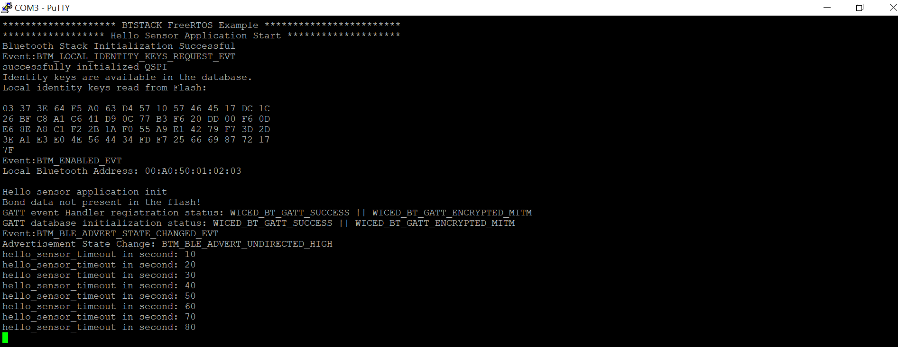
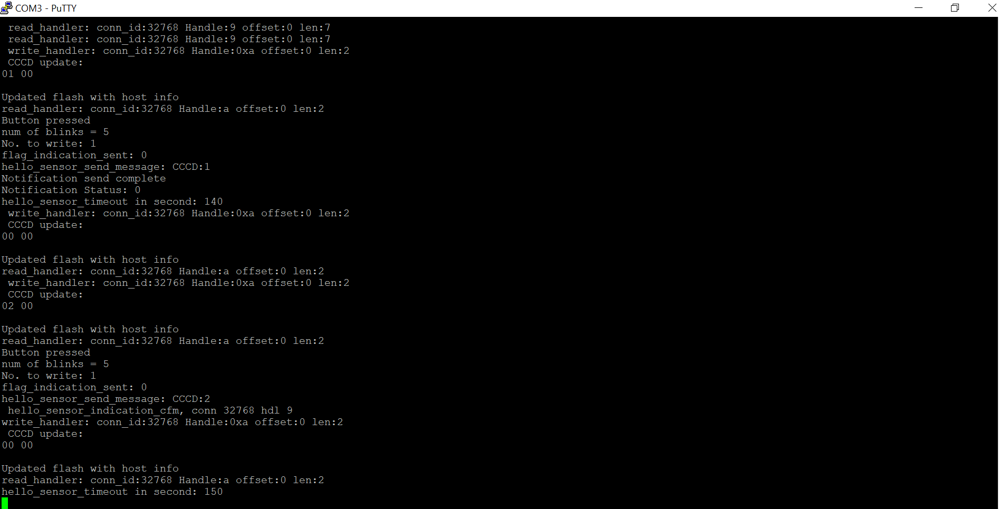
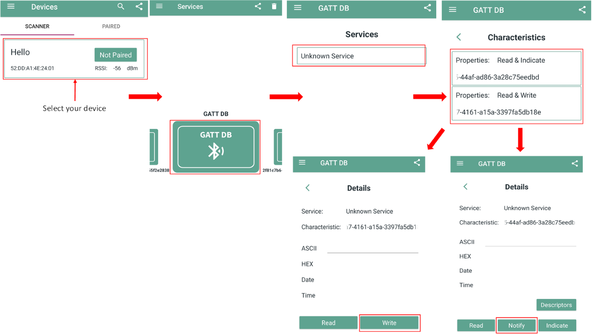
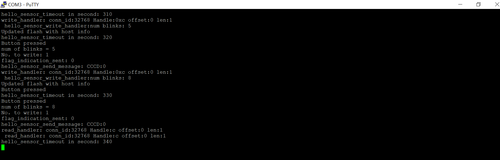
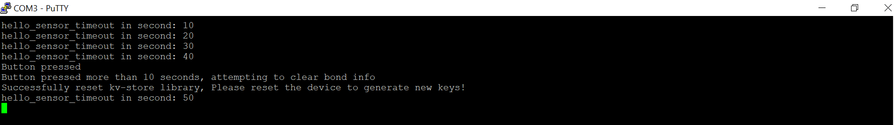
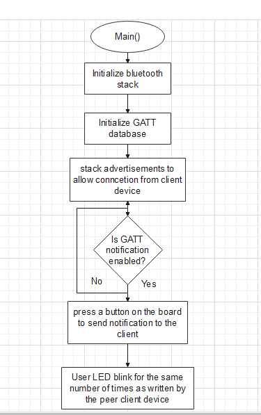

# BTSTACK: Bluetooth&reg; LE hello sensor

This code example demonstrates the implementation of a Bluetooth&reg; LE custom service with Bluetooth&reg; security using AIROC&trade; CYW20829/CYW89829, PSOC&trade; 6, and ModusToolbox&trade; environment.

[View this README on GitHub.](https://github.com/Infineon/mtb-example-btstack-freertos-hello-sensor)

[Provide feedback on this code example.](https://cypress.co1.qualtrics.com/jfe/form/SV_1NTns53sK2yiljn?Q_EED=eyJVbmlxdWUgRG9jIElkIjoiQ0UyMzUxNTAiLCJTcGVjIE51bWJlciI6IjAwMi0zNTE1MCIsIkRvYyBUaXRsZSI6IkJUU1RBQ0s6IEJsdWV0b290aCZyZWc7IExFIGhlbGxvIHNlbnNvciIsInJpZCI6ImhlZ2RlbmlkaGkiLCJEb2MgdmVyc2lvbiI6IjUuMC4wIiwiRG9jIExhbmd1YWdlIjoiRW5nbGlzaCIsIkRvYyBEaXZpc2lvbiI6Ik1DRCIsIkRvYyBCVSI6IklDVyIsIkRvYyBGYW1pbHkiOiJCVEFCTEUifQ==)


## Requirements

- [ModusToolbox&trade;](https://www.infineon.com/modustoolbox) v3.2 or later (tested with v3.5)
- Board support package (BSP) minimum required version for:
   - PSOC&trade; 6 MCU: v5.0.0
   - XMC7000 MCU: v2.3.0
   - CY8CKIT-062-BLE/CY8CPROTO-063-BLE/CYBLE-416045-EVAL: v4.0.0
   - CYW920829M2EVK-02/CYW989829M2EVB-01: v3.0.0
- Programming language: C
- Associated parts: All [XMC7000 MCU](https://www.infineon.com/cms/en/product/microcontroller/32-bit-industrial-microcontroller-based-on-arm-cortex-m/32-bit-xmc7000-industrial-microcontroller-arm-cortex-m7/), [AIROC&trade; CYW20829 Bluetooth&reg; LE SoC](https://www.infineon.com/cms/en/product/promopages/airoc20829), [PSOC&trade; 6 MCU with AIROC&trade; Bluetooth&reg; LE](https://www.infineon.com/cms/en/product/microcontroller/32-bit-psoc-arm-cortex-microcontroller/psoc-6-32-bit-arm-cortex-m4-mcu/psoc-63/)


## Supported toolchains (make variable 'TOOLCHAIN')

- GNU Arm&reg; Embedded Compiler v11.3.1 (`GCC_ARM`) – Default value of `TOOLCHAIN`
- Arm&reg; Compiler v6.22 (`ARM`)
- IAR C/C++ Compiler v9.50.2 (`IAR`)


## Supported kits (make variable 'TARGET')

- [AIROC&trade; CYW20829 Bluetooth&reg; LE Evaluation Kit](https://www.infineon.com/CYW920829M2EVK-02) (`CYW920829M2EVK-02`) – Default value of `TARGET`
- [AIROC&trade; CYW89829 Bluetooth&reg; LE Evaluation Kit](https://www.infineon.com/cms/en/product/wireless-connectivity/airoc-bluetooth-le-bluetooth-multiprotocol/airoc-bluetooth-le/cyw89829) (`CYW989829M2EVB-01`)
- [PSOC&trade; 6 Wi-Fi Bluetooth&reg; Prototyping Kit](https://www.infineon.com/CY8CPROTO-062-4343W) (`CY8CPROTO-062-4343W`)
- [PSOC&trade; 6 Wi-Fi Bluetooth&reg; Pioneer Kit](https://www.infineon.com/CY8CKIT-062-WIFI-BT) (`CY8CKIT-062-WIFI-BT`)
- [PSOC&trade; 62S2 Wi-Fi Bluetooth&reg; Pioneer Kit](https://www.infineon.com/CY8CKIT-062S2-43012) (`CY8CKIT-062S2-43012`, `CY8CEVAL-062S2-CYW955513SDM2WLIPA`)
- [PSOC&trade; 62S1 Wi-Fi Bluetooth&reg; Pioneer Kit](https://www.infineon.com/CYW9P62S1-43438EVB-01) (`CYW9P62S1-43438EVB-01`)
- [PSOC&trade; 62S1 Wi-Fi Bluetooth&reg; Pioneer Kit](https://www.infineon.com/CYW9P62S1-43012EVB-01) (`CYW9P62S1-43012EVB-01`)
- [PSOC&trade; 62S3 Wi-Fi Bluetooth&reg; Prototyping Kit](https://www.infineon.com/CY8CPROTO-062S3-4343W) (`CY8CPROTO-062S3-4343W`)
- [PSOC&trade; 62S2 Evaluation Kit](https://www.infineon.com/CY8CEVAL-062S2) (`CY8CEVAL-062S2`, `CY8CEVAL-062S2-LAI-4373M2`, `CY8CEVAL-062S2-LAI-43439M2`, `CY8CEVAL-062S2-MUR-4373EM2`, `CY8CEVAL-062S2-MUR-4373M2`, `CY8CEVAL-062S2-CYW43022CUB`)
- [PSOC&trade; 6 Bluetooth&reg; LE Pioneer Kit](https://www.infineon.com/CY8CKIT-062-BLE) (`CY8CKIT-062-BLE`)
- [PSOC&trade; 6 Bluetooth&reg; LE Prototyping Kit](https://www.infineon.com/CY8CPROTO-063-BLE) (`CY8CPROTO-063-BLE`)
- [EZ-BLE Arduino Evaluation Board](https://www.infineon.com/cms/en/product/evaluation-boards/cyble-416045-eval/) (`CYBLE-416045-EVAL`)
- [PSOC&trade; 62S2 Wi-Fi Bluetooth&reg; Prototyping Kit](https://www.infineon.com/CY8CPROTO-062S2-43439) (`CY8CPROTO-062S2-43439`)
- [PSOC&trade; 6 AI Evaluation Kit](https://www.infineon.com/CY8CKIT-062S2-AI) (`CY8CKIT-062S2-AI`)
- [XMC7200 Evaluation Kit](https://www.infineon.com/KIT_XMC72_EVK) (`KIT_XMC72_EVK_MUR_43439M2`)


## Hardware setup

This example uses the board's default configuration. See the kit user guide to ensure that the board is configured correctly.

> **Note:** The PSOC&trade; 6 Bluetooth&reg; LE Pioneer Kit (CY8CKIT-062-BLE) and the PSOC&trade; 6 Wi-Fi Bluetooth&reg; Pioneer Kit (CY8CKIT-062-WIFI-BT) ship with KitProg2 installed. ModusToolbox&trade; requires KitProg3. Before using this code example, make sure that the board is upgraded to KitProg3. The tool and instructions are available in the [Firmware Loader](https://github.com/Infineon/Firmware-loader) GitHub repository. If you do not upgrade, you will see an error like "unable to find CMSIS-DAP device" or "KitProg firmware is out of date".

> **Note:** The AIROC&trade; CYW20829 Bluetooth&reg; Kit (CYW920829M2EVK-02) ships with KitProg3 version 2.21 installed. The ModusToolbox&trade; requires KitProg3 with latest version 2.40. Before using this code example, make sure that the board is upgraded to KitProg3. The tool and instructions are available in the [Firmware Loader](https://github.com/Infineon/Firmware-loader) GitHub repository. If you do not upgrade, you will see an error such as "unable to find CMSIS-DAP device" or "KitProg firmware is out of date".


## Software setup

Download and install the AIROC&trade; Bluetooth&reg; Connect App for [iOS](https://apps.apple.com/in/app/airoc-bluetooth-connect-app/id6443702288) or [Android](https://play.google.com/store/apps/details?id=com.infineon.airocbluetoothconnect).

Scan the following QR codes from your mobile phone to download the AIROC&trade; Bluetooth&reg; Connect App.


Install a terminal emulator if you do not have one. Instructions in this document use [Tera Term](https://teratermproject.github.io/index-en.html).


## Using the code example


### Create the project

The ModusToolbox&trade; tools package provides the Project Creator as both a GUI tool and a command line tool.

<details><summary><b>Use Project Creator GUI</b></summary>

1. Open the Project Creator GUI tool

   There are several ways to do this, including launching it from the dashboard or from inside the Eclipse IDE. For more details, see the [Project Creator user guide](https://www.infineon.com/ModusToolboxProjectCreator) (locally available at *{ModusToolbox&trade; install directory}/tools_{version}/project-creator/docs/project-creator.pdf*)

2. On the **Choose Board Support Package (BSP)** page, select a kit supported by this code example. See [Supported kits](#supported-kits-make-variable-target)

   > **Note:** To use this code example for a kit not listed here, you may need to update the source files. If the kit does not have the required resources, the application may not work

3. On the **Select Application** page:

   a. Select the **Applications(s) Root Path** and the **Target IDE**

      > **Note:** Depending on how you open the Project Creator tool, these fields may be pre-selected for you

   b. Select this code example from the list by enabling its check box

      > **Note:** You can narrow the list of displayed examples by typing in the filter box

   c. (Optional) Change the suggested **New Application Name** and **New BSP Name**

   d. Click **Create** to complete the application creation process

</details>


<details><summary><b>Use Project Creator CLI</b></summary>

The 'project-creator-cli' tool can be used to create applications from a CLI terminal or from within batch files or shell scripts. This tool is available in the *{ModusToolbox&trade; install directory}/tools_{version}/project-creator/* directory.

Use a CLI terminal to invoke the 'project-creator-cli' tool. On Windows, use the command-line 'modus-shell' program provided in the ModusToolbox&trade; installation instead of a standard Windows command-line application. This shell provides access to all ModusToolbox&trade; tools. You can access it by typing "modus-shell" in the search box in the Windows menu. In Linux and macOS, you can use any terminal application.

The following example clones the "[Hello sensor](https://github.com/Infineon/mtb-example-btstack-freertos-hello-sensor)" application with the desired name "HelloSensor" configured for the *CYW920829M2EVK-02* BSP into the specified working directory, *C:/mtb_projects*:

   ```
   project-creator-cli --board-id CYW920829M2EVK-02 --app-id mtb-example-btstack-freertos-hello-sensor --user-app-name HelloSensor --target-dir "C:/mtb_projects"
   ```

The 'project-creator-cli' tool has the following arguments:

Argument | Description | Required/optional
---------|-------------|-----------
`--board-id` | Defined in the <id> field of the [BSP](https://github.com/Infineon?q=bsp-manifest&type=&language=&sort=) manifest | Required
`--app-id`   | Defined in the <id> field of the [CE](https://github.com/Infineon?q=ce-manifest&type=&language=&sort=) manifest | Required
`--target-dir`| Specify the directory in which the application is to be created if you prefer not to use the default current working directory | Optional
`--user-app-name`| Specify the name of the application if you prefer to have a name other than the example's default name | Optional

<br>

> **Note:** The project-creator-cli tool uses the `git clone` and `make getlibs` commands to fetch the repository and import the required libraries. For details, see the "Project creator tools" section of the [ModusToolbox&trade; tools package user guide](https://www.infineon.com/ModusToolboxUserGuide) (locally available at {ModusToolbox&trade; install directory}/docs_{version}/mtb_user_guide.pdf).

</details>


### Open the project

After the project has been created, you can open it in your preferred development environment.


<details><summary><b>Eclipse IDE</b></summary>

If you opened the Project Creator tool from the included Eclipse IDE, the project will open in Eclipse automatically.

For more details, see the [Eclipse IDE for ModusToolbox&trade; user guide](https://www.infineon.com/MTBEclipseIDEUserGuide) (locally available at *{ModusToolbox&trade; install directory}/docs_{version}/mt_ide_user_guide.pdf*).

</details>


<details><summary><b>Visual Studio (VS) Code</b></summary>

Launch VS Code manually, and then open the generated *{project-name}.code-workspace* file located in the project directory.

For more details, see the [Visual Studio Code for ModusToolbox&trade; user guide](https://www.infineon.com/MTBVSCodeUserGuide) (locally available at *{ModusToolbox&trade; install directory}/docs_{version}/mt_vscode_user_guide.pdf*).

</details>


<details><summary><b>Arm&reg; Keil&reg; µVision&reg;</b></summary>

Double-click the generated *{project-name}.cprj* file to launch the Keil&reg; µVision&reg; IDE.

For more details, see the [Arm&reg; Keil&reg; µVision&reg; for ModusToolbox&trade; user guide](https://www.infineon.com/MTBuVisionUserGuide) (locally available at *{ModusToolbox&trade; install directory}/docs_{version}/mt_uvision_user_guide.pdf*).

</details>


<details><summary><b>IAR Embedded Workbench</b></summary>

Open IAR Embedded Workbench manually, and create a new project. Then select the generated *{project-name}.ipcf* file located in the project directory.

For more details, see the [IAR Embedded Workbench for ModusToolbox&trade; user guide](https://www.infineon.com/MTBIARUserGuide) (locally available at *{ModusToolbox&trade; install directory}/docs_{version}/mt_iar_user_guide.pdf*).

</details>


<details><summary><b>Command line</b></summary>

If you prefer to use the CLI, open the appropriate terminal, and navigate to the project directory. On Windows, use the command-line 'modus-shell' program; on Linux and macOS, you can use any terminal application. From there, you can run various `make` commands.

For more details, see the [ModusToolbox&trade; tools package user guide](https://www.infineon.com/ModusToolboxUserGuide) (locally available at *{ModusToolbox&trade; install directory}/docs_{version}/mtb_user_guide.pdf*).

</details>


## Operation
1. Connect the board to your PC using the provided USB cable through the KitProg3 USB connector

2. Use your favorite serial terminal application tool and connect to the KitProg3 COM port. Configure the terminal application to access the serial port using the following settings:

   Baud rate: 115200 bps; Data: 8 bits; Parity: None; stop: 1 bit; Flow control: None; New line for receiving data: Line Feed(LF) or auto setting

3. Program the board using one of the following:

   <details><summary><b>Using Eclipse IDE</b></summary>

      1. Select the application project in the Project Explorer

      2. In the **Quick Panel**, scroll down, and click **\<Application Name> Program (KitProg3_MiniProg4)**
   </details>


   <details><summary><b>In other IDEs</b></summary>

   Follow the instructions in your preferred IDE.

   </details>


   <details><summary><b>Using CLI</b></summary>

     From the terminal, execute the `make program` command to build and program the application using the default toolchain to the default target. The default toolchain is specified in the application's Makefile but you can override this value manually:
      ```
      make program TOOLCHAIN=<toolchain>
      ```

      Example:
      ```
      make program TOOLCHAIN=GCC_ARM
      ```
   </details>

4. After programming, the application starts automatically. Observe the messages on the UART terminal and wait for the device to connect with the peer client (for example, the AIROC&trade; Bluetooth&reg; Connect App). Use the KitProg3 COM port to view the Bluetooth&reg; stack and application trace messages in the terminal window:

   **Figure 1. Log messages on KitProg3 COM port**

   

5. To test using the AIROC&trade; Bluetooth&reg; Connect App, do the following (see the equivalent AIROC&trade; Bluetooth&reg; Connect App screenshots in **Figure 2** and **Figure 3**):

   1. Turn ON Bluetooth&reg; on your Android or iOS device

   2. Launch the AIROC&trade; Bluetooth&reg; Connect App

   3. Swipe down on the AIROC&trade; Bluetooth&reg; Connect App home screen to start scanning for Bluetooth&reg; LE peripherals; your device (“Hello") appears on the AIROC&trade; Bluetooth&reg; Connect App home screen. Select your device to establish a Bluetooth&reg; LE connection

   4. In the Services page, choose the first characteristic to enable notifications/indications. Register for notifications or indications. This will, in turn, initiate the pairing process

   5. Press the user button 1 in the kit and observe that notification/indication is being received in the mobile app

      **Figure 2. Log messages on KitProg3 COM port**

      

      **Figure 3. Testing with the AIROC&trade; Bluetooth&reg; Connect App on Android**

      

   6. You can choose the second characteristic, write a numeric value into it, and observe that the user LED on the board will blink as many times as the number written in the 'Blink' characteristic. Note that the numeric value written should range from 0-9 only
      
      **Figure 4. Log messages on KitProg3 COM port**

      

6. To forget a bonded device, press and hold the user button for more than 10 seconds and then release it. Ensure that the device is not in a connected state before performing this. User LED on the kit will be constantly turned ON for the first 5 seconds and it will start blinking for 5 more seconds to indicate that the device is entering new mode

   **Figure 5. Log messages on KitProg3 COM port**

   


## Steps to enable BTSpy logs

> **Note:** This feature is available only for CYW920829M2EVK-02 and CYW989829M2EVB-01.

1. Add *airoc-hci-transport* from Library Manager before enabling spy traces, check airoc-hci-transport [README.md](https://github.com/Infineon/airoc-hci-transport/blob/master/README.md) for more details. If the airoc-hci-transport library is included in the application, it is recommended to initialize it (`Call cybt_debug_uart_init()`). If the airoc-hci-transport library is present in the application, but you want to use the retarget-io library to get application traces in Tera Term/PuTTy, you need to set the `ENABLE_AIROC_HCI_TRANSPORT_PRINTF` macro value to '0' in the application. Otherwise printf messages of the application will not be visible

   #define ENABLE_AIROC_HCI_TRANSPORT_PRINTF 1

2. Navigate to the application Makefile and open it. Find the Makefile variable `ENABLE_SPY_TRACES` and set it to the value `1` as shown:
    ```
    ENABLE_SPY_TRACES = 1
    ```
3. Save the Makefile, and then build and program the application to the board.

4. Open the [ClientControl](https://github.com/Infineon/btsdk-host-apps-bt-ble/tree/master/client_control) application and make the following settings:
   - Set the baud rate to 3000000
   - Deselect the flow control checkbox
   - Select the serial port and click on an open port
   
5. Launch the [BTSpy](https://github.com/Infineon/btsdk-utils/tree/master/BTSpy) tool

6. Press and release the reset button on the board to get the BTSpy logs on the BTSpy tool


## Debugging

You can debug the example to step through the code.


<details><summary><b>In Eclipse IDE</b></summary>

Use the **\<Application Name> Debug (KitProg3_MiniProg4)** configuration in the **Quick Panel**. For details, see the "Program and debug" section in the [Eclipse IDE for ModusToolbox&trade; user guide](https://www.infineon.com/MTBEclipseIDEUserGuide).

> **Note:** **(Only while debugging)** On the CM4 CPU, some code in `main()` may execute before the debugger halts at the beginning of `main()`. This means that some code executes twice – once before the debugger stops execution, and again after the debugger resets the program counter to the beginning of `main()`. See [PSOC&trade; 6 MCU: Code in main() executes before the debugger halts at the first line of main()](https://community.infineon.com/docs/DOC-21143) to learn about this and for the workaround.

> **Note:** Debugging is of limited value when there is an active Bluetooth&reg; LE connection because as soon as the Bluetooth&reg; LE device stops responding, the connection will get dropped.

</details>


<details><summary><b>In other IDEs</b></summary>

Follow the instructions in your preferred IDE.

</details>


## Design and implementation

The code example configures the device as a Bluetooth&reg; LE GAP Peripheral and GATT Server. The example implements a custom GATT service called "Hello_Sensor" service and has two custom characteristics - Notify and Blink. The notify characteristic sends a notification or indication to the peer client device upon button press events. The Blink characteristic is used by the peer client to write the number of times the onboard user LED should blink.

The application uses a UART resource from the Hardware Abstraction Layer (HAL) to print debug messages on a UART terminal emulator. The UART resource initialization and retargeting of standard I/O to the UART port are done using the retarget-io library.

Upon reset, the application starts automatically and initializes BTSTACK and other device peripherals. The device starts to advertise its presence to the peer Central devices. Once a Bluetooth&reg; LE connection is established, the peer client device can register for notifications/indications to be received using the CCCD handle of the Notify characteristic. Because the CCCD handle of the Notify characteristic requires write authentication, an attempt to enable notification/indication will trigger the pairing process at the Central side. Once the pairing process completes, the peer device's link keys and addresses are stored in the device's flash memory and therefore bonded.

The user button on the board is configured to trigger an interrupt on the falling edge. The user button has three functions based on the duration of the button press. An onboard LED indicates the type of button press.

1. **Short button press:** Press and release the button quickly to start undirected high advertisements if no connection exists. If a connection exists and notifications/indications are enabled, sends a notification/indication packet to the peer client device

2. **Button press for 5 seconds:** Press and hold the button for 5 seconds to enter pairing mode. In pairing mode, you can connect to a new peer device. An onboard LED turns ON for 5 seconds to indicate when to release the button to enter this mode

3. **Button press for 10 seconds:** Press and hold the button for 10 seconds to erase the bonding information from the flash memory of the device. The onboard LED will be constantly turned ON for the first 5 seconds and it will start blinking for 5 more seconds to indicate that the device is entering new mode

> **Note:** The device must be disconnected from the peer client device before erasing the bonding information from the flash memory.

The peer client can also write the number of times the user LED on the board blinks using the Blink characteristic.

**Figure 6. Hello sensor process flowchart**




## Resources and settings

This section explains the ModusToolbox&trade; resources and their configurations as used in this code example. Note that all the configurations explained in this section have already been implemented in the code example.

- **Device Configurator:** ModusToolbox&trade; stores the configuration settings of the application in the *design.modus* file. This file is used by the Device Configurator, which generates the configuration firmware. This firmware is stored in the application’s *GeneratedSource* folder.

   By default, all applications in a workspace share the same *design.modus* file - i.e., they share the same pin configuration. Each BSP has a default *design.modus* file in the *mtb_shared\TARGET_\<bsp name\>\<version\>\COMPONENT_BSP_DESIGN_MODUS* directory. It is not recommended to modify the configuration of a standard BSP directly.

   To modify the configuration for a single application or to create a custom BSP, see the [ModusToolbox&trade; user guide](https://www.infineon.com/MTBEclipseIDEUserguide). This example uses the default configuration. See the [Device Configurator guide](https://www.infineon.com/ModusToolboxDeviceConfig).

- **Bluetooth&reg; Configurator:** The Bluetooth&reg; peripheral has an additional configurator called the “Bluetooth&reg; Configurator” that is used to generate the Bluetooth&reg; LE GATT database and various Bluetooth&reg; settings for the application. These settings are stored in the file named *design.cybt*.

   Note that unlike the Device Configurator, the Bluetooth&reg; configurator settings and files are local to each respective application. The services and characteristics added are explained in the [Design and implementation](#design-and-implementation) section. See the [Bluetooth&reg; Configurator guide](https://www.infineon.com/ModusToolboxBLEConfig).

> **Note:** For PSOC&trade; 6 Bluetooth&reg; LE-based BSPs (CY8CKIT-062-BLE, CY8CPROTO-063-BLE, CYBLE-416045-EVAL) with support for AIROC&trade; BTSTACK, if you want to use the bt-configurator tool, select the *AIROC&trade; BTSTACK with Bluetooth&reg; LE only (CYW20829, PSOC&trade; 6 with CYW43xxx connectivity device)* option from the drop-down to select the device. Do not use the *PSOC&trade; Bluetooth&reg; LE Legacy Stack (PSOC&trade; 6-BLE)* option because it is not compatible with AIROC&trade; BTSTACK.

**Table 1. Application resources**

 Resource  |  Alias/object     |    Purpose
 :------- | :------------    | :------------
 UART (HAL) |cy_retarget_io_uart_obj | UART HAL object used by Retarget-IO for the Debug UART port
 GPIO (HAL)    | CYBSP_USER_LED1         | This LED will blink the number of times as written by the peer client device
 GPIO (HAL)    | CYBSP_USER_LED2         | This LED serves as an indication for a button press of 10-second duration
 GPIO (HAL)    | CYBSP_USER_BTN         | Used to send notifications to the peer client on button press events

<br>


## Related resources

Resources  | Links
-----------|----------------------------------
Application notes  | [AN228571](https://www.infineon.com/AN228571) – Getting started with PSOC&trade; 6 MCU on ModusToolbox&trade; <br>  [AN215656](https://www.infineon.com/AN215656) – PSOC&trade; 6 MCU: Dual-CPU system design
Code examples  | [Using ModusToolbox&trade;](https://github.com/Infineon/Code-Examples-for-ModusToolbox-Software) on GitHub
Device documentation | [PSOC&trade; 6 MCU datasheets](https://documentation.infineon.com/html/psoc6/bnm1651211483724.html) <br> [PSOC&trade; 6 technical reference manuals](https://documentation.infineon.com/html/psoc6/zrs1651212645947.html) <br> [AIROC&trade; CYW20829 Bluetooth&reg; LE SoC](https://www.infineon.com/cms/en/product/promopages/airoc20829)
Development kits | Select your kits from the [Evaluation board finder](https://www.infineon.com/cms/en/design-support/finder-selection-tools/product-finder/evaluation-board)
Libraries on GitHub  | [mtb-pdl-cat1](https://github.com/Infineon/mtb-pdl-cat1) – PSOC&trade; 6 Peripheral Driver Library (PDL)  <br> [mtb-hal-cat1](https://github.com/Infineon/mtb-hal-cat1) – Hardware Abstraction Layer (HAL) library <br> [retarget-io](https://github.com/Infineon/retarget-io) – Utility library to retarget STDIO messages to a UART port
Middleware on GitHub  | [capsense](https://github.com/Infineon/capsense) – CAPSENSE&trade; library and documents <br> [psoc6-middleware](https://github.com/Infineon/modustoolbox-software#psoc-6-middleware-libraries) – Links to all PSOC&trade; 6 MCU middleware
Tools  | [ModusToolbox&trade;](https://www.infineon.com/modustoolbox) – ModusToolbox&trade; software is a collection of easy-to-use libraries and tools enabling rapid development with Infineon MCUs for applications ranging from wireless and cloud-connected systems, edge AI/ML, embedded sense and control, to wired USB connectivity using PSOC&trade; Industrial/IoT MCUs, AIROC&trade; Wi-Fi and Bluetooth&reg; connectivity devices, XMC&trade; Industrial MCUs, and EZ-USB&trade;/EZ-PD&trade; wired connectivity controllers. ModusToolbox&trade; incorporates a comprehensive set of BSPs, HAL, libraries, configuration tools, and provides support for industry-standard IDEs to fast-track your embedded application development

<br>


## Other resources

Infineon provides a wealth of data at [www.infineon.com](https://www.infineon.com) to help you select the right device, and quickly and effectively integrate it into your design.


## Document history

Document title: *CE235150* – *BTSTACK: Bluetooth&reg; LE hello sensor*

 Version | Description of change
 ------- | ---------------------
 1.0.0   | New code example
 2.1.0   | Support for three PSOC&trade; 6 Bluetooth&reg; LE BSPs <br>Feature addition - long button press to remove bond data from NVRAM <br>kv-store implementation using internal flash <br>Workaround added in the application for Note 2
 3.0.0   | Updated to support ModusToolbox&trade; v3.0 and BSPs v4.X
 3.1.0   | Introduction of pairing-mode, new button press mode to enter pairing-mode
 3.2.0   | Added support for CY8CEVAL-062S2-LAI-43439M2, CY8CPROTO-062S2-43439
 3.3.0   | Removed CYW920829M2EVB-01 from supported kits <br> Added support for CYW920829M2EVK-02
 3.4.0   | Added support for CY8CEVAL-062S2-MUR-4373EM2 and CY8CEVAL-062S2-MUR-4373M2
 3.5.0   | Fix reconnection issue due to duplication of bond data entries(BDA) in NVRAM
 3.6.0   | Added support for CYW989829M2EVB-01
 3.7.0   | Added support for CY8CEVAL-062S2-CYW43022CUB and CY8CKIT-062S2-AI
 3.8.0   | Added support for CYW989829M2EVB-03
 4.0.0   | BSP and BTStack-integration major update for Bluetooth&reg; firmware as a separate asset and removal of combo devices as does not support FW as a separate asset 
 4.1.0   | Added support for CY8CEVAL-062S2-CYW955513SDM2WLIPA
 4.2.0   | Added support for KIT_XMC72_EVK_MUR_43439M2
 4.2.1   | Minor Makefile updates
 5.0.0   | Remove support for CYW989829M2EVB-03 and updated btstack-integration with version 6.X
<br>


All referenced product or service names and trademarks are the property of their respective owners.

The Bluetooth&reg; word mark and logos are registered trademarks owned by Bluetooth SIG, Inc., and any use of such marks by Infineon is under license.

PSOC&trade;, formerly known as PSoC&trade;, is a trademark of Infineon Technologies. Any references to PSoC&trade; in this document or others shall be deemed to refer to PSOC&trade;.

---------------------------------------------------------

© Cypress Semiconductor Corporation, 2020-2025. This document is the property of Cypress Semiconductor Corporation, an Infineon Technologies company, and its affiliates ("Cypress").  This document, including any software or firmware included or referenced in this document ("Software"), is owned by Cypress under the intellectual property laws and treaties of the United States and other countries worldwide.  Cypress reserves all rights under such laws and treaties and does not, except as specifically stated in this paragraph, grant any license under its patents, copyrights, trademarks, or other intellectual property rights.  If the Software is not accompanied by a license agreement and you do not otherwise have a written agreement with Cypress governing the use of the Software, then Cypress hereby grants you a personal, non-exclusive, nontransferable license (without the right to sublicense) (1) under its copyright rights in the Software (a) for Software provided in source code form, to modify and reproduce the Software solely for use with Cypress hardware products, only internally within your organization, and (b) to distribute the Software in binary code form externally to end users (either directly or indirectly through resellers and distributors), solely for use on Cypress hardware product units, and (2) under those claims of Cypress's patents that are infringed by the Software (as provided by Cypress, unmodified) to make, use, distribute, and import the Software solely for use with Cypress hardware products.  Any other use, reproduction, modification, translation, or compilation of the Software is prohibited.
<br>
TO THE EXTENT PERMITTED BY APPLICABLE LAW, CYPRESS MAKES NO WARRANTY OF ANY KIND, EXPRESS OR IMPLIED, WITH REGARD TO THIS DOCUMENT OR ANY SOFTWARE OR ACCOMPANYING HARDWARE, INCLUDING, BUT NOT LIMITED TO, THE IMPLIED WARRANTIES OF MERCHANTABILITY AND FITNESS FOR A PARTICULAR PURPOSE.  No computing device can be absolutely secure.  Therefore, despite security measures implemented in Cypress hardware or software products, Cypress shall have no liability arising out of any security breach, such as unauthorized access to or use of a Cypress product. CYPRESS DOES NOT REPRESENT, WARRANT, OR GUARANTEE THAT CYPRESS PRODUCTS, OR SYSTEMS CREATED USING CYPRESS PRODUCTS, WILL BE FREE FROM CORRUPTION, ATTACK, VIRUSES, INTERFERENCE, HACKING, DATA LOSS OR THEFT, OR OTHER SECURITY INTRUSION (collectively, "Security Breach").  Cypress disclaims any liability relating to any Security Breach, and you shall and hereby do release Cypress from any claim, damage, or other liability arising from any Security Breach.  In addition, the products described in these materials may contain design defects or errors known as errata which may cause the product to deviate from published specifications. To the extent permitted by applicable law, Cypress reserves the right to make changes to this document without further notice. Cypress does not assume any liability arising out of the application or use of any product or circuit described in this document. Any information provided in this document, including any sample design information or programming code, is provided only for reference purposes.  It is the responsibility of the user of this document to properly design, program, and test the functionality and safety of any application made of this information and any resulting product.  "High-Risk Device" means any device or system whose failure could cause personal injury, death, or property damage.  Examples of High-Risk Devices are weapons, nuclear installations, surgical implants, and other medical devices.  "Critical Component" means any component of a High-Risk Device whose failure to perform can be reasonably expected to cause, directly or indirectly, the failure of the High-Risk Device, or to affect its safety or effectiveness.  Cypress is not liable, in whole or in part, and you shall and hereby do release Cypress from any claim, damage, or other liability arising from any use of a Cypress product as a Critical Component in a High-Risk Device. You shall indemnify and hold Cypress, including its affiliates, and its directors, officers, employees, agents, distributors, and assigns harmless from and against all claims, costs, damages, and expenses, arising out of any claim, including claims for product liability, personal injury or death, or property damage arising from any use of a Cypress product as a Critical Component in a High-Risk Device. Cypress products are not intended or authorized for use as a Critical Component in any High-Risk Device except to the limited extent that (i) Cypress's published data sheet for the product explicitly states Cypress has qualified the product for use in a specific High-Risk Device, or (ii) Cypress has given you advance written authorization to use the product as a Critical Component in the specific High-Risk Device and you have signed a separate indemnification agreement.
<br>
Cypress, the Cypress logo, and combinations thereof, ModusToolbox, PSoC, CAPSENSE, EZ-USB, F-RAM, and TRAVEO are trademarks or registered trademarks of Cypress or a subsidiary of Cypress in the United States or in other countries. For a more complete list of Cypress trademarks, visit www.infineon.com. Other names and brands may be claimed as property of their respective owners.
